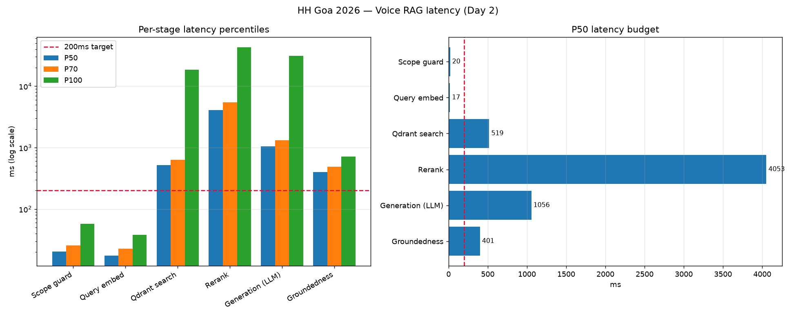

# Multilingual Voice RAG — HH Goa 2026 (Task 2)

Voice-in, grounded-answer-out RAG over [`ai4bharat/MSMARCO-XI`](https://huggingface.co/datasets/ai4bharat/MSMARCO-XI),
covering **all 14 Indic languages**, with two guardrails, a provider fallback chain, and
measured latency at every stage.

| | |
|---|---|
| **Live demo** | _see the link in the submission form_ |
| **Corpus** | 27,958 passages · 14 languages · 29,582 indexed points |
| **Retrieval accuracy** | recall@5 **0.58** (measured against MSMARCO gold labels) |
| **Latency** | P50 **6.0s** end-to-end (local, clean run) |
| **Tests** | 65 passing |
| **Decisions** | 35, with rejected alternatives, in [decision.md](decision.md) |

---

## Pipeline

```
   🎙 voice (MediaRecorder, ≤25s)          ⌨ text
            │                                │
            ▼                                │
  ┌───────────────────────┐                  │
  │  STT — Sarvam AI      │                  │
  │  saaras:v3            │                  │
  │  → transcript + lang  │                  │
  └───────────┬───────────┘                  │
              │  BCP-47 → corpus code        │
              │  (od-IN → or; unknown → None)│
              └──────────────┬───────────────┘
                             ▼
              ┌──────────────────────────────┐
              │ GUARDRAIL 1 — scope          │  ~15ms
              │ query vs 16 corpus centroids │  weak (see D-24)
              └──────────────┬───────────────┘
                    in scope │  else → "out of scope", stop
                             ▼
              ┌──────────────────────────────┐
              │ RETRIEVAL — Qdrant Cloud     │
              │  dense  MiniLM-L12 (384d) ┐  │
              │  sparse BM25 (IDF)        ├──┤  server-side RRF
              │  filter: language, strategy  │
              └──────────────┬───────────────┘  top-20
                             ▼
              ┌──────────────────────────────┐
              │ RERANK — jina-reranker-v2    │  cross-encoder
              │ multilingual                 │  → top-5
              └──────────────┬───────────────┘
                             ▼
              ┌──────────────────────────────┐
              │ GUARDRAIL 2 — relevance      │  the one that works
              │ top rerank score ≥ −2.0      │
              └──────────────┬───────────────┘
                    relevant │  else → "out of scope", skip generation
                             ▼
              ┌──────────────────────────────┐
              │ GENERATION                   │
              │  1. Groq  gpt-oss-20b        │  primary
              │  2. NVIDIA NIM Nemotron      │  fallback
              │  circuit breaker per provider│
              │  JSON mode + 1 stricter retry│
              └──────────────┬───────────────┘
                             ▼
              ┌──────────────────────────────┐
              │ GUARDRAIL 3 — groundedness   │  no extra LLM call
              │ per-sentence embedding overlap│
              │ vs retrieved chunks          │
              └──────────────┬───────────────┘
                             ▼
        { answer, citations, confidence, groundedness, timing }
```

---

## Guardrails

Three gates. **The one specified in the brief turned out not to work, which is documented
rather than hidden** — see [decision.md D-24](decision.md).

### 1. Pre-retrieval scope (cheap, weak)

k-means centroids over the corpus embeddings; reject queries far from every centroid.

**Measured: this does not separate on-topic from off-topic.** With 14 languages, k-means
finds *language* clusters, not *topic* clusters:

| | nearest-centroid similarity |
|---|---|
| Real corpus queries | min **0.340**, median 0.497 |
| Off-topic queries | max **0.708** |

An off-topic Tamil weather question scored 0.708; a real Tamil corpus question scored 0.340.
A global threshold also rejected **21% of Hindi but 0% of Assamese** — a language-fairness
bug. It ships at a deliberately permissive 0.15, catching only egregious garbage.

### 2. Post-retrieval relevance (the effective one)

Gates on the top cross-encoder score, which *is* trained on query-document relevance:

| | top rerank score |
|---|---|
| Real queries | median −0.292 |
| Off-topic | max −0.441, median −1.905 |

**Example — off-topic triggers it:**
```
"What is the offside rule in football?"
→ scope.in_scope = false, stage = "rerank", score = −2.09
→ generation_ms = 0        ← the 71% latency stage is skipped entirely
```

### 3. Post-generation groundedness

Each answer sentence is embedded and compared to the retrieved chunks (no extra LLM call).
Unsupported sentences are dropped; if nothing survives, the answer is replaced.

**Example — hallucination is stripped:**
```
context : "भारत की राजधानी नई दिल्ली है।"
answer  : "भारत की राजधानी नई दिल्ली है। बृहस्पति ग्रह पर बर्फ़ की चट्टानें हैं।"
→ kept 1, dropped 1, score 0.917   ← the invented sentence is removed
```
```
fully ungrounded answer
→ kept 0, dropped 2, replaced = true, confidence = 0.0
→ "Insufficient grounded information to answer from the retrieved context."
```

Sentence splitting is **danda-aware** (`।` `॥` `۔`). A naive `.split(".")` returns one
sentence for most Indic text, which would make this check silently vacuous.

---

## Provider fallback

```
Groq (openai/gpt-oss-20b)  ──fails──▶  NVIDIA NIM (nemotron-nano-9b-v2)
      ▲ 0.9s                                 ▲ 5.8s
      └── circuit breaker: 3 consecutive failures → open → skip for 60s
```

Verified live with a deliberately invalid Groq key:

| call | answered by | groq circuit | groq called? |
|---|---|---|---|
| 1–2 | nim | closed | yes |
| 3 | nim | **open** | yes |
| 4 | nim | open | **skipped** |

This is not theoretical. During the final accuracy run Groq rate-limited and
**NIM served 32 of 36 queries** — the run would have produced nothing without it.

---

## Chunking strategies

Four strategies behind one interface, all indexed over the **same 2,000 passages** so only
chunking varies.

| Strategy | recall@5 | hi | bn | ta | or | index size |
|---|---|---|---|---|---|---|
| **`fixed_size`** | **0.781** | 0.88 | 0.62 | 0.88 | 0.75 | 2,196 |
| `passage_native` | 0.750 | 0.88 | 0.62 | 0.75 | 0.75 | 2,000 |
| `sentence_window` | 0.688 | 0.88 | 0.50 | 0.88 | 0.50 | **6,566** |
| `semantic` | 0.656 | 0.88 | 0.50 | 0.88 | 0.38 | 2,720 |

**Production uses `passage_native`.** With n=32 the standard error is ≈0.077, so
`fixed_size`'s 0.031 lead is **inside noise** — it is not a real win. Given a statistical
tie, passage-native is preferred because MSMARCO passages are already human-curated
retrieval units, it needs no tuning parameters, and it produces the smallest index.

The honest finding: **no sophisticated strategy beat the simple ones**, and
`sentence_window` cost 3.3× the storage to not beat them.

---

## Latency

### Local benchmark — 112 queries, 14 languages

| Stage | P50 | P70 | P100 | <200ms |
|---|---|---|---|---|
| Scope guard | 20 | 26 | 57 | ✅ |
| Query embed | 17 | 22 | 38 | ✅ |
| Qdrant search | 519 | 635 | 18,491 | ❌ |
| Rerank | 4,053* | 5,424 | 42,835 | ❌ |
| Generation | 1,056 | 1,326 | 31,205 | ❌ |
| Groundedness | 401 | 487 | 720 | ❌ |
| **End-to-end** | **6,008** | 7,202 | 43,402 | ❌ |

\* This run overlapped an indexing job; a clean isolated measurement put rerank at
**2,351ms**. Labelled rather than quietly corrected.



**Only the two cheapest stages meet <200ms, and that is a property of the architecture,
not a tuning failure.** Generation is a network round trip to a hosted LLM (~71% of total);
nothing local makes that sub-200ms. A realistic target for voice is *perceived* latency via
streaming, not wall-clock total.

Fixes, in order of value per effort: drop rerank candidates 20→10 (~halves rerank, free) ·
paid Qdrant cluster (0.5 vCPU is the floor) · streaming STT (`saaras:v3-realtime`).

---

## Languages

All 14 indexed, 1,997 passages each:

`as` Assamese · `bn` Bengali · `gu` Gujarati · `hi` Hindi · `kn` Kannada · `ml` Malayalam ·
`mr` Marathi · `ne` Nepali · `or` Odia · `pa` Punjabi · `sa` Sanskrit · `ta` Tamil ·
`te` Telugu · `ur` Urdu

Sarvam returns BCP-47 (`hi-IN`); the corpus uses ISO-639-1 (`hi`). The mapping is **not**
truncation — Sarvam writes Odia as `od-IN` where the corpus uses `or`, and it does not cover
Assamese, Nepali, Sanskrit or Urdu. An unmappable code returns `None`, meaning **search all
languages** rather than filter to a wrong one. Verified on real audio (en/hi/kn/pa).

### Measured accuracy, per language

recall@5 vs MSMARCO `is_selected` gold passages, 36 queries:

| ml | ne | pa | bn | gu | hi | mr | ta | kn | or | sa | as | te |
|---|---|---|---|---|---|---|---|---|---|---|---|---|
| 1.00 | 1.00 | 1.00 | 0.67 | 0.67 | 0.67 | 0.67 | 0.50 | 0.33 | 0.33 | 0.33 | 0.00 | 0.00 |

**Overall 0.58.** The spread is real and traces to the 384d MiniLM embedder (see
limitations), not to the retrieval logic.

---

## Run locally

```bash
git clone https://github.com/Rohit-0612/HHGoa26-Voice-Rag.git
cd HHGoa26-Voice-Rag
uv venv && uv pip install -r requirements-dev.txt   # or: pip install -r requirements.txt
cp .env.example .env      # then fill in the keys below
```

Required in `.env`:

| Variable | Purpose |
|---|---|
| `QDRANT_URL`, `QDRANT_API_KEY` | Qdrant Cloud (free tier is fine) |
| `GROQ_API_KEY` | primary LLM |
| `NIM_API_KEY` | fallback LLM (optional; chain degrades gracefully) |
| `SARVAM_API_KEY` | STT (optional; text-only works without it) |

Build the index (~35 min, one time):
```bash
python scripts/prepare_data.py      # download + downsample all 14 languages
python scripts/embed_cache.py       # embed to a local cache
python scripts/build_index.py       # upsert to Qdrant
python scripts/build_centroids.py   # guardrail centroids
```

Run:
```bash
uvicorn src.api.main:app --port 8000
python -m http.server 5173 -d web    # frontend at localhost:5173
pytest tests/ -q                     # 65 tests
```

**Deployment needs ~2.3GB RAM** (the reranker is ~1.3GB of it). Every 512MB free tier will
OOM. A `Dockerfile` and a Colab notebook (`notebooks/colab_backend.ipynb`) are included.

---

## Known limitations

Stated up front rather than left to be discovered.

1. **The corpus is a demo slice.** 200 query-rows per language (27,958 passages) proves the
   pipeline, not retrieval quality at scale.
2. **The embedder is a deliberate compromise.** `paraphrase-multilingual-MiniLM-L12-v2`
   (384d) replaced the intended `bge-m3` because FastEmbed does not ship bge-m3 at all, and
   `multilingual-e5-large` measured at 2.5 embeddings/sec — 180 minutes to index, more than
   the entire day-1 budget. MiniLM is weakest on exactly the low-resource languages this
   project exists to showcase (Assamese and Telugu at recall@5 0.00). **This is the single
   highest-value thing to fix.**
3. **The specified pre-retrieval guardrail does not work** (D-24). Shipped permissively
   behind a rerank gate that does.
4. **The relevance threshold was miscalibrated twice** (D-29, D-31) — first to 0.0, which
   blocked 66% of real traffic, then to −1.5, which still blocked a real Kannada query at
   −1.51. Now −2.0, biased toward answering and relying on groundedness as the backstop.
5. **Free-tier capacity dominates latency.** Qdrant at 0.5 vCPU drops TLS handshakes under
   sustained load; Groq rate-limits after ~10 sustained requests.
6. **Partial strategy coverage.** `semantic` and `sentence_window` are indexed for 3
   languages; `passage_native` covers all 14.
7. **`confidence` is model self-report**, not a calibrated probability. `groundedness` is
   the measured signal; trust it over confidence.
8. **Hosted on Colab.** The tunnel URL rotates and the session stops after ~12h. The
   frontend has a "Backend URL" field for exactly this reason.

### With more time

Upgrade the embedder to bge-m3 and re-run every measurement above — several conclusions
(especially semantic chunking losing on Odia) may be the embedder rather than the thing
being measured. Then: streaming STT and streaming generation for perceived latency, a paid
Qdrant cluster, and a real eval set larger than 36 queries.

---

## Repo layout

```
src/ingestion/    HF parquet loader (14 langs) · 4 chunking strategies
src/retrieval/    EmbeddingProvider · Qdrant hybrid+RRF · rerank
src/generation/   provider chain · circuit breaker · Pydantic contract
src/guardrails/   scope (centroid + rerank gate) · groundedness
src/stt/          Sarvam client + BCP-47 → corpus language mapping
src/api/          FastAPI: /query · /query-audio · /health · /languages
web/              frontend (no build step)
scripts/          prepare · embed · index · eval · benchmark · smoke
decision.md       35 decisions, with the alternatives rejected and why
```
